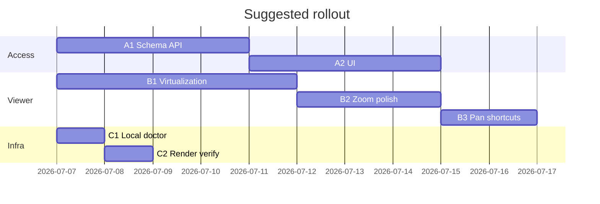

# Plan: Project Access UI, PDF Fluidity, Server Setup

**Created:** July 6, 2026  
**Status:** Proposed  
**Context:** RAG improvement work is **stashed** (`git stash list` → `WIP: RAG improvements and follow-up fixes`). Resume with `git stash pop` when ready.

---

## Goals

| Workstream | Outcome |
|------------|---------|
| **A. Project access UI** | One project admin can invite/manage teammates per project — not whole-org sharing |
| **B. PDF scroll & zoom** | Large plan sets feel smooth; zoom/pan match pro viewer expectations |
| **C. Server setup** | Repeatable local + hosted environments for the team |

---

## A. Project access — admin assigns users

### Current state (gap)

- **Data model:** `users.org_id` + `projects.org_id`. Everyone in the same org sees **all** org projects.
- **Access changes:** CLI only — `pnpm grant:org-access` moves a user’s org or role.
- **Roles:** Org-scoped `super | admin | pm | member` on `users.role` — not per-project.
- **UI:** Dashboard lists org projects; onboarding says “share the demo URL” — no invite/manage surface.
- **Auth gate:** `getProjectOrThrow(projectId, req.orgId)` — org match only.

### Target model

```
Organization
  └── Project (OneDrive folder binding)
        ├── project_admin_user_id  (creator or designated admin)
        └── project_members[]      (user_id, role: admin | member, invited_at, invited_by)
```

**Rules (proposed):**

| Actor | Can do |
|-------|--------|
| Project admin | Invite/remove members, transfer admin, bind OneDrive folder, trigger sync |
| Project member | Read/search/chat, view files — no folder binding or member management |
| Org super/admin | Create projects, assign initial project admin, archive project |

Non-members never see the project in dashboard or API, even if same org.

### Phase A1 — Schema & API (backend)

1. **Migration** `project_members` table:
   - `project_id`, `user_id`, `role` (`admin` | `member`), `invited_by`, `created_at`
   - Unique `(project_id, user_id)`; index on `user_id`
2. **Backfill:** For each existing project, add all users in `projects.org_id` as `member`; set project creator (or first org `admin`) as `admin` if traceable, else org admin.
3. **`projectService` guards:**
   - `listProjects(userId)` → join `project_members`, not org-wide list
   - `assertProjectAccess(userId, projectId, minRole?)` on all project routes
4. **New endpoints:**
   - `GET /projects/:id/members`
   - `POST /projects/:id/members` `{ email, role }` — admin only; user must exist (signed in once) or return “pending invite” stub (phase A3)
   - `DELETE /projects/:id/members/:userId`
   - `PATCH /projects/:id/members/:userId` — role change / transfer admin
5. **Deprecate org-wide project listing** for non-super users; keep `grant:org-access` for bootstrap/migration only.

**Acceptance:** API returns 403 for non-member; member cannot POST members; admin can add/remove.

### Phase A2 — Dashboard & workspace UI

1. **Project settings panel** (dashboard + workspace header):
   - Members table: name, email, role, remove (admin)
   - “Add teammate” — email input + role dropdown
   - Copy invite link: `/login?next=/workspace/chat?projectId=…` (works after admin adds them)
2. **Empty states:**
   - No projects → “Ask your admin for access” (not “create project” for members)
   - Pending access errors → clear message vs generic 403
3. **Role-aware chrome:**
   - Hide OneDrive folder binding + sync controls for `member`
   - Show “Project admin” badge for admin
4. **Update `OnboardingModal`** — replace “share demo URL” with “your admin will add you” + link to request access doc.

**Files (primary):** `apps/web/app/page.tsx`, new `ProjectMembersPanel.tsx`, `packages/shared/src/api/*`, auth store.

**Acceptance:** Admin adds George by email; George sees only assigned projects after login.

### Phase A3 — Polish (optional, post-MVP)

- Email invite for users who haven’t signed in yet (`project_invites` table)
- Audit log: who added/removed whom
- Microsoft tenant boundary warning when invitee is different org

### Risks

| Risk | Mitigation |
|------|------------|
| MLJ-017 demo breaks (everyone in one org today) | Backfill script + keep one shared “demo project” with explicit member list |
| OneDrive token is per-user | Document that **admin’s** OneDrive connection drives sync; members consume index |

---

## B. PDF scrolling & zoom fluidity

### Current state

- `ConstructionPdfViewer.tsx`: continuous scroll (default), CSS transform preview + debounced `react-pdf` scale commit (`ZOOM_COMMIT_IDLE_MS = 280`).
- **No page virtualization** — all pages mount in continuous mode → jank on 100+ sheet sets.
- Pinch/Ctrl+wheel zoom with focal point ✅; Spacebar pan ❌; middle-mouse pan ❌.
- Existing audits: `apps/web/docs/pdf-navigation-competitor-audit.md`, `pdf-viewer-fix-plan.md`, `pdf-viewer-gap-audit.md`.

### Phase B1 — Scroll performance (highest impact)

1. **Visible-page virtualization** in continuous mode:
   - `IntersectionObserver` on `data-page` wrappers
   - Render viewport ±2 pages; placeholder divs preserve scroll height
   - Cache rendered page canvases in a `Map<page, offscreen>` for fast re-entry
2. **Scroll sync:** Throttle `onVisiblePageChange` to animation frame; avoid React state per scroll tick.
3. **Metrics:** Target 60fps scroll on 200-page PRDC fixture; memory cap (unmount far-off pages).

**Acceptance:** 150-page PDF scrolls without multi-second layout stalls; CPU stays reasonable.

### Phase B2 — Zoom fluidity

1. **Wheel capture** — attach `{ capture: true, passive: false }` on `continuousScrollRef` + `documentHostRef` (per fix plan P2).
2. **Commit pipeline:**
   - Tune `ZOOM_COMMIT_IDLE_MS` (280 → 320ms) + double-`rAF` before clearing preview transform
   - `.pdf-zoom-committing` crossfade (200ms) to hide scale flash
3. **Zoom presets:** toolbar dropdown 50/75/100/150% + shortcuts `Ctrl+0` fit page, `Ctrl+1` 100%
4. **Regression tests** in `ConstructionPdfViewer.test.tsx` for wheel/pinch focal math.

**Acceptance:** Ctrl+wheel on trackpad feels continuous; no visible “jump” on commit in manual testing.

### Phase B3 — Pan & navigation ergonomics

1. **Spacebar hold-to-pan** (P0 in competitor audit) — temporary hand tool without mode switch
2. **Middle-mouse drag pan** in continuous scroll
3. **Page Up/Down** when focus in viewer

**Acceptance:** User can pan while markup tool selected (Space); middle-click pan works on desktop.

### Suggested order

`B1 virtualization` → `B2 zoom` → `B3 pan` (virtualization unlocks scroll; zoom polish is incremental).

---

## C. Server setup

### Current state

| Environment | Config | Docs |
|-------------|--------|------|
| Local dev | `pnpm dev` + `.env` | `README.md` |
| Docker full stack | `docker-compose.yml` | backend + web + optional docling |
| Docker demo | `docker-compose.demo.yml` + `pnpm demo:up` | `docs/DEMO_DEPLOYMENT.md` |
| Production demo | `render.yaml` blueprint | Render + Neon + Azure OAuth |

Gaps: no single “verify everything” script; Render secrets manual; Redis optional but indexing worker needs it for full sync pipeline.

### Phase C1 — Local developer setup (this machine / team laptops)

**Checklist script** `scripts/dev-doctor.sh` (or `pnpm doctor`):

```bash
# Verifies: node 18+, pnpm, .env present, DATABASE_URL reachable,
# optional REDIS_URL, OPENAI/GEMINI key, curl /health/api
```

**`.env` minimum for chat + search against MLJ-017:**

```env
DATABASE_URL=postgresql://...neon...
OPENAI_API_KEY=...          # or GEMINI_API_KEY
MICROSOFT_CLIENT_ID=...
MICROSOFT_CLIENT_SECRET=...
OAUTH_REDIRECT_URI=http://localhost:3000/auth/callback
```

**Run:**

```bash
cp .env.example .env   # fill secrets
pnpm install
pnpm dev               # web :3000, api :3001
# OR
pnpm demo:up           # Docker against Neon
```

**Acceptance:** `curl localhost:3001/health/api` OK; login works; MLJ-017 project loads.

### Phase C2 — Shared demo (Render)

1. **Blueprint apply** from `render.yaml` (branch `main`)
2. **Dashboard secrets** (api service):

   | Variable | Required |
   |----------|----------|
   | `DATABASE_URL` | Neon team string |
   | `MICROSOFT_CLIENT_ID` / `SECRET` | Azure app |
   | `OAUTH_REDIRECT_URI` | `https://<web-host>/auth/callback` |
   | `GEMINI_API_KEY` or `OPENAI_API_KEY` | Chat |
   | `CANARY_PROJECT_IDS` | Optional; hybrid rollout |

3. **Azure:** Web redirect URI for Render web host
4. **Post-deploy smoke:**

   ```bash
   curl https://contractorai-api.onrender.com/health/api
   curl -I https://contractorai-web.onrender.com/
   ```

5. **Access:** Use project-members flow (A) or interim `pnpm grant:org-access` for teammates

**Acceptance:** Teammate opens Render URL → Microsoft login → sees assigned project → chat returns cited answer.

### Phase C3 — Indexing / sync (optional for full pipeline)

| Component | Local | Render |
|-----------|-------|--------|
| Redis | `docker-compose.yml` redis service | Set `REDIS_URL` (Upstash or Render Redis) |
| Indexing worker | Starts with backend if `REDIS_URL` set | Same |
| Docling sidecar | Optional in compose | Usually skip for demo |

Without Redis: read-only chat against existing Neon index works; new sync/index queues won’t run.

### Phase C4 — Operational runbook (short)

Add to `docs/DEMO_DEPLOYMENT.md`:

- Who is project admin for MLJ-017 demo
- How to add a user (UI after A2, or CLI until then)
- How to rotate OAuth secret
- Where eval/smoke logs live (note: full smoke eval is slow ~90s/query with hybrid+LLM rerank on 964k chunks — use `eval:smoke-search` with `RETRIEVAL_RERANK_PROVIDER=heuristic` for faster regression)

---

## Recommended sequencing



**Parallel tracks:** C1 can start immediately; A1 and B1 can run in parallel by different owners.

---

## Out of scope (this plan)

- Resuming stashed RAG improvements (separate branch when eval budget allows)
- Mobile app project access
- Billing / seat licensing
- Full email invite flow (A3)

---

## Next actions

1. **Confirm access model** — project-level members vs org admin assigns to project (this plan assumes per-project `project_members`).
2. **Pick hosting target** — Render demo vs local Docker for George’s testing.
3. **Create branches:** `feat/project-members`, `feat/pdf-virtualization`, `chore/dev-doctor`.
4. **Unstash RAG work** on a dedicated branch when ready to continue eval fixes.
