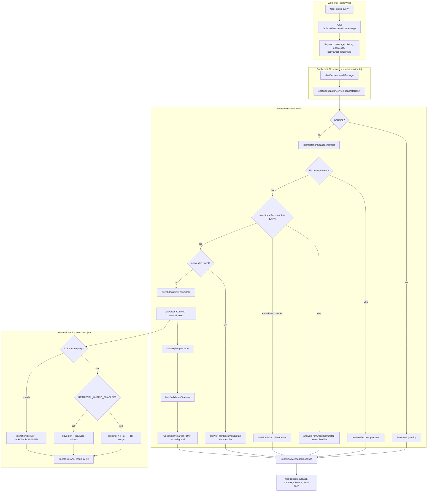

# System Overview & Failure Modes

**Audience:** PMs, engineers, and eval authors  
**Last updated:** June 25, 2026  
**Branch:** `main` (retrieval tier2 merged)  
**Companion docs:** [retrieval-how-it-works.md](./retrieval-how-it-works.md), [eval-failure-taxonomy.md](./eval-failure-taxonomy.md)

---

## Executive summary

ContractorAI answers construction PM questions by routing a user query through **interpretation → retrieval → chunk selection → LLM generation → citation verification**. The system is strong when users name a document identifier (`QWP-005`, `DRFI-0047`) or ask about content in an **open document**. It is weaker on **activity-based discovery** (“SWP for platform concrete demolition”), **doc-family disambiguation** (PRDC vs conformed specs, follow-up RFIs), and the **retrieval–generation gap** where the right file is found but the answer is refused or shallow.

Rough eval snapshot (MLJ-017 corpus, June 2026):

| Layer | Pass rate (representative sets) | Dominant pain |
|-------|--------------------------------|---------------|
| Identifier lookup | ~100% | Rare wrong family member |
| Realistic retrieval (top-3) | ~80% | Doc-type / schedule confusion |
| Full answer (PM harness) | ~50% | Verifier refusals, hydration, shape mismatch |

---

## 1. End-to-end flow

### Diagram (logical pipeline)



### Step-by-step (what happens on each message)

| Step | Where | What happens |
|------|-------|--------------|
| **1. User input** | `apps/web/app/workspace/chat/page.tsx` | User sends prompt. Client POSTs to `/api/chat/sessions/:id/message` with last 8 turns, open tabs, and active document name/ID. |
| **2. Session + persist** | `chat.service.ts` | Validates session, stores user message, calls coordinator. |
| **3. Query resolution** | `chat-coordinator.service.ts` | Rewrites deictic references (“this PDF”) to active filename; decides if retrieval should be **scoped to open doc**. |
| **4. Interpretation** | `interpretation.service.ts` | Rules-first classifier (+ optional LLM if `CHAT_INTERPRETER_ENABLE_LLM=true`). Enriches with parsed construction identifiers. Output: intent, confidence, retrieval hints. |
| **5. Routing waterfall** | `generateReply()` | Short-circuits for greetings, file lookup, exact-ID Q&A, active-doc paths before generic RAG. |
| **6. Retrieval** | `routeGraphContext()` → `searchProject()` | Domain tags + interpretation hints; returns up to 8 files with up to 3 chunks each (400 chars). |
| **7. Chunk selection** | `buildNodesFromSearchResults()` | Scores chunks, dedupes, caps at **10 nodes / ~3000 tokens** for LLM context. Specialist lanes (doc/sched/cost) get sub-budgets. |
| **8. Generation** | `callSingleAgent()` | System prompt + depth mode for factual queries; project snapshot + retrieved chunks in user prompt. Fallback: deterministic evidence snippets if LLM unavailable. |
| **9. Citations** | `buildValidatedCitations()` | Up to 8 citations; strict token verification on factual queries when enabled. |
| **10. Guardrails** | Coordinator | Strict factual active-doc refusals, uncertainty footnote, alias formatting. |
| **11. Response** | Web UI | Renders markdown, source chips, optional auto-open to cited page. |

### Key source files

| File | Role |
|------|------|
| `apps/web/app/workspace/chat/page.tsx` | Chat UI, API calls, doc viewer integration |
| `packages/backend/src/server.ts` | `POST /api/chat/sessions/:id/message` route |
| `packages/backend/src/services/chat.service.ts` | Session CRUD, delegates to coordinator |
| `packages/backend/src/services/chat-coordinator.service.ts` | Full answer waterfall, LLM, citations |
| `packages/backend/src/services/interpretation.service.ts` | Intent + retrieval hints |
| `packages/backend/src/services/retrieval.service.ts` | Hybrid search, exact-ID, boosts |
| `packages/backend/src/services/identifier-lookup.service.ts` | Deterministic ID → file |
| `packages/backend/src/services/retrieval-reranker.service.ts` | Heuristic or LLM rerank |

---

## 2. Retrieval pipeline

### Two entry paths: exact-ID vs hybrid search

| Path | Trigger | Behavior |
|------|---------|----------|
| **Exact-ID** | Query contains indexed identifier (`QWP`, `RFI`, `DRFI`, `CSI`, etc.) and DB available | `lookupExactIdentifier` → revision/status family resolution → `rankChunksWithinFile` for content terms. **Bypasses** vector/FTS ranking. |
| **Hybrid search** | No exact-ID match (or preview API) | Parallel **pgvector** (cosine ANN) + **FTS** (`websearch_to_tsquery`), fused with **RRF** (Reciprocal Rank Fusion, k=60). |

**When hybrid is used:** Controlled by rollout flag `RETRIEVAL_HYBRID_ENABLED` (off globally by default; on in tier2 demo / canary projects). If hybrid merge is empty → **keyword/trigram** fallback.

**Blend profile** (intent-driven lexical vs semantic weight):

| Intent | Profile | Semantic | Lexical |
|--------|---------|----------|---------|
| `file_lookup`, `active_doc_qa` | lexical_heavy | 35% | 65% |
| `document_summary` | semantic_heavy | 70% | 30% |
| default | `RETRIEVAL_BLEND_PROFILE` env | 50% | 50% |

### Post-merge processing (both paths)

Applied in order:

1. **Garbage filter** — drops mojibake/binary extraction chunks (`filterLowQualityChunks`)
2. **Source type policy** — prefers `content` vs `summary` vs `metadata_stub` based on query intent
3. **Interpretation boost** — category/tag/recency/status/spec-section hints (when confidence ≥ 0.6)
4. **File identity boost** — filename/path token overlap (+0.3 × overlap)
5. **Specification chunk boost** — CSI section numbers, spec intent words
6. **Rerank** (optional) — heuristic (`0.65×relevance + 0.35×lexical`) or LLM rerank head
7. **Group by file** — up to 3 chunks/file, 400 chars each; **collapse document families** (duplicate format/disposition copies)

### Exact-ID family resolution

When multiple files share an identifier, ranking order:

1. Approval status rank (APP/NET > RWC > ORIG > VOID)
2. Higher revision number
3. Most recently modified

Returns `exactIdentifier` metadata + full `family[]` of superseded members.

### Chat-specific retrieval settings

`routeGraphContext()` calls:

```typescript
searchProject(projectId, query, {
  topK: 8,
  minRelevance: 0.1,
  tags: buildRetrievalTags(domains),
  interpretation: retrievalInterpretation,  // only if confidence ≥ 0.65
  includeChunks: true,
});
```

**Active doc scope:** When user asks a content question with a document open, results filter to `preferredFileId` (or return empty if `requirePreferredFile`).

### Chunk selection for LLM

| Limit | Value |
|-------|-------|
| Max graph nodes | 10 |
| Context token budget | ~3,000 tokens |
| Chunks per file in search | 3 (400 chars each) |
| Specialist sub-budget | ~1,000 tokens per lane |

Chunks are re-scored by query token overlap before filling the budget. Unreadable/garbage chunks are filtered.

### Metadata filters (gaps)

| Filter | Vector | FTS/Keyword | Exact-ID |
|--------|--------|-------------|----------|
| projectId | ✅ | ✅ | ✅ |
| category | ✅ | ✅ | — |
| tags | ❌ | ✅ | — |
| date range | ❌ | ❌ | — |
| specSection column | ❌ | ❌ | — |

Tags filter **only** lexical legs — vector search ignores tags today.

---

## 3. Generation pipeline

### System prompts

**Base (`STATIC_SYSTEM_PROMPT`):** ContractorAI identity, grounding rules, markdown format (## heading + bullets), domain expertise, workspace awareness, no legal advice.

**Depth mode (`DEPTH_MODE_ADDENDUM`):** Appended when `isFactualIntent(query)` matches WH-questions, spec/requirement language, etc. Instructs: list **every** matching item, quote numbers/dates/names, synthesize across chunks, longer bullets allowed.

### Context assembly

`buildUserPrompt()` includes:

- Query + domain focus
- Open tabs / active document
- **Project snapshot** (indexing %, open RFIs, pending submittals, recent COs)
- **Retrieved context block** — selected graph nodes (chunk text)

History: last **8 turns** sent to LLM.

### Output limits

| Mode | max_tokens |
|------|------------|
| Default | 1,024 |
| Depth / factual | 2,048 |
| Detailed extraction (active doc) | 768 |
| LLM timeout | 12s |

### Active document path (`answerFromDocumentDetail`)

When a file is open or exact-ID resolves, the coordinator loads **full document chunks** (not just top-3 search hits) and runs a richer pipeline:

- Section anchor detection and scoped chunk ranking
- Lexical evidence matching with bigram boosts
- **Detailed extraction** path for list/enumeration queries (LLM interprets matched passages)
- Deterministic section summaries for spec review queries

### Citation building

`buildValidatedCitations()`:

- Maps graph nodes → source files
- Resolves page numbers (chunk metadata fallback if enabled)
- **Strict verification** (factual queries + `CHAT_STRICT_CITATION_VERIFICATION_ENABLED`): chunk must contain ≥2 query tokens (with special rules for negation, expansion-joint phrases)
- Caps at **8 citations**

### Refusal & uncertainty templates

| Template | When | User sees |
|----------|------|-----------|
| `buildNoExactEvidenceContent()` | Strict factual mode, no keyword/evidence match in active doc | “I could not find an exact indexed passage… Refine with a section heading…” |
| `buildSectionSuggestionContent()` | Factual query, section hints but no verified anchor | “Could not verify a single exact section… Review: 3.5, 3.5.1…” |
| **Need Indexed** | Exact-ID or direct doc found, zero chunks | “I found [file], but I do not have indexed text…” |
| `withUncertaintyMarker()` | Factual query, LLM answered, but **zero citations** and **zero context nodes** | Answer + footnote: “could not validate direct chunk-level evidence…” |
| LLM unavailable fallback | No API key / timeout | Evidence snippet list from top lexical chunks |
| Empty retrieval | No graph nodes | “Could not find enough indexed graph context… indexing at X%” |

### Feature flags (env)

| Flag | Effect |
|------|--------|
| `CHAT_ACTIVE_DOC_BOOST_ENABLED` | Prefer full-doc path when doc open |
| `CHAT_STRICT_FACTUAL_ACTIVE_DOC_MODE` | Refuse instead of uncertain answer when no evidence |
| `CHAT_STRICT_CITATION_VERIFICATION_ENABLED` | Drop citations failing token verification |
| `CHAT_CITATION_FALLBACK_ENABLED` | Allow page from chunk metadata |
| `RETRIEVAL_HYBRID_ENABLED` | Vector + FTS hybrid |
| `RETRIEVAL_RERANK_ENABLED` | Rerank stage |

---

## 4. Failure mode catalog

For each stage: **what goes wrong**, **symptom**, **eval example**, **severity / likelihood**.

### 4.1 Interpretation & routing

| Failure | Symptom | Example | Sev / Likelihood |
|---------|---------|---------|------------------|
| **Wrong intent** | Retrieval uses wrong blend profile or skips exact-ID hint | Activity find classified as `general_qa` instead of `file_lookup` | Medium / Occasional |
| **LLM classifier off** | Rules fallback at 0.55 confidence; weak retrieval hints | Default path without `CHAT_INTERPRETER_ENABLE_LLM` | Medium / Common (prod default) |
| **Active doc scope too aggressive** | Question about another file answered from open tab | User asks about RFI-063 while QWP is open | Medium / When doc open |
| **Active doc scope missed** | Open doc ignored; project-wide search | Deictic “what does it say” without matching patterns | Low / Edge case |
| **File lookup short-circuit** | Returns file list/card, no content answer | “Find the SWP for demolition” → file pointer only | Low / By design for pure lookup |

### 4.2 Retrieval misses & wrong document

| Failure | Symptom | Example (eval) | Sev / Likelihood |
|---------|---------|----------------|------------------|
| **R-01 Wrong file (similar name)** | Confident answer from adjacent doc | `real-08` SWP → meeting minutes | **High / Common** for activity finds |
| **R-03 Doc-type confusion** | PRDC volume vs conformed specs | `real-03`, `real-04` | **High / Common** |
| **R-05 Schedule disambiguation** | Wrong month/variant schedule | `real-14` LOE % → `a1.pdf` | **High / Common** |
| **R-06 Spec vs drawing (CSI)** | Drawing set for spec question | `find-05` vs `answer-03` | Medium / Occasional |
| **R-08 Boilerplate noise** | Address/letterhead matches unrelated permit | Smoke: 7/110 address queries | Medium / Smoke-heavy |
| **R-11 Acronym collision** | “HASP” → environmental boring program | `real-29` | Medium / Occasional |
| **Hybrid off in prod** | Vector-only misses lexical matches | PM guide #1 | **High / Config-dependent** |
| **Tags not on vector leg** | Category/tag hints ignored by semantic search | Tagged spec queries | Medium / Systemic |

### 4.3 Revision & duplicate collisions

| Failure | Symptom | Example | Sev / Likelihood |
|---------|---------|---------|------------------|
| **R-04 Wrong family member** | Follow-up RFI vs original; wrong GEN rev | `answer-11`, `answer-02` GEN-019R00 vs R03 | **High / Common** for RFIs |
| **Family resolver wrong status** | Approved vs RWC revision picked incorrectly | Multi-rev submittals | Medium / Occasional |
| **Duplicate copies in top-K** | Same logical doc occupies slots | Mitigated by `collapseDocumentFamilies` | Low / Reduced |

### 4.4 Chunk quality & selection

| Failure | Symptom | Example | Sev / Likelihood |
|---------|---------|---------|------------------|
| **Garbage chunks** | Nonsense or binary mojibake in context | ~18% corpus (filtered at retrieval) | Medium / Mitigated |
| **Wrong chunk selected** | TOC/header chunk instead of body | QWP form header dump (`G-04`) | **High / Common** for QWP/RFI |
| **Top-3 chunk limit** | Answer covers one section, user wanted full doc | “List all hold points” → one bullet | **High / Common** |
| **400-char truncation** | Missing trailing requirement text | Long spec paragraphs | Medium / Systemic |
| **Context budget exhausted** | 10 nodes / 3K tokens drops relevant chunks | Cross-doc synthesis (`C3`) | Medium / Occasional |

### 4.5 Context shape mismatch

| Failure | Symptom | Example | Sev / Likelihood |
|---------|---------|---------|------------------|
| **G-04 Overspecific** | Single hold point when user wanted overview | QWP “quality risks” → one bullet | **High / Common** |
| **G-03 Underspecific** | Topic summary missing requested %/person | RFI-0183 “who answered” | **High / Common** |
| **G-09 List not exhaustive** | Partial enumeration | QWP hold-point archetypes | **High / Common** |
| **Overview vs extraction** | Summary path vs depth mode mismatch | `answer-02` file overview | Medium / Occasional |

### 4.6 LLM generation errors

| Failure | Symptom | Example | Sev / Likelihood |
|---------|---------|---------|------------------|
| **G-05 Wrong synthesis** | Plausible prose from wrong retrieved doc | MOWE “10 days” from Vol 04 not survey | **High / When retrieval wrong** |
| **Hallucination under weak context** | Invented spec/requirement | `not_found` bucket failures | Medium / Low relevance queries |
| **G-06 Wrong scope** | Answers adjacent identifier in query | RFI-0140 when asked RFI-063 | Medium / Multi-ID queries |
| **Output truncation** | 1024-token cap cuts long lists | Large hold-point tables | Medium / Occasional |
| **LLM timeout** | Falls back to snippet list | 12s budget exceeded | Low / Rare |

### 4.7 Citation verifier blocking good answers

| Failure | Symptom | Example | Sev / Likelihood |
|---------|---------|---------|------------------|
| **G-01 Verifier refusal** | “Could not verify exact section” despite correct file | `real-26` DRFI-0099 | **High / Common** |
| **Strict token mismatch** | Citations dropped; triggers factual refusal | Chunk paraphrased vs query tokens | **High / When strict mode on** |
| **G-07 Refusal despite citations** | Lists sources then says “context does not contain” | chunk-audit MOWE survey | Medium / Occasional |
| **Zero citations + uncertainty** | Good LLM answer with disclaimer footnote | Routed RAG with strict verify | Medium / By design |

### 4.8 Strict factual mode refusals

| Failure | Symptom | Example | Sev / Likelihood |
|---------|---------|---------|------------------|
| **G-02 Need Indexed / no hydration** | File found, no chunks to answer | `answer-02` QWP-001 | **High / When indexing lagging** |
| **Evidence threshold too strict** | `buildNoExactEvidenceContent` on valid but fuzzy match | Active doc WH-questions | **High / strictFactualActiveDocMode** |
| **Section suggestions only** | Points to sections without answering | `real-26` compare/versus | Medium / Spec queries |

### 4.9 Missing indexed content & hydration gaps

| Failure | Symptom | Example | Sev / Likelihood |
|---------|---------|---------|------------------|
| **R-12 Unindexed media** | ZIP/video/attachment in catalog, no text | chunk-audit AVI-082 zip | Medium / Common for media |
| **Indexing in progress** | “Indexing at X%” message | New project sync | Low / Transient |
| **Failed index** | File exists but no chunks | Failed files in snapshot | Medium / Per-file |
| **Exact-ID without chunks** | Tier-1 file card only (legacy; tier2 adds `rankChunksWithinFile`) | Bare ID + content Q before reindex | Medium / Reduced in tier2 |

### 4.10 Ambiguous queries handled poorly

| Failure | Symptom | Example | Sev / Likelihood |
|---------|---------|---------|------------------|
| **G-10 Silent wrong pick** | Should disambiguate 2–3 files; picks one | `ambiguous-01`–`04` | Medium / When top-1 wrong |
| **No disambiguation template** | Single confident file vs candidate list | “Burnside schedule” | Medium / Systemic gap |
| **Station name noise** | Generic station PDF wins | `find-09`, `ambiguous-04` | Medium / Occasional |

### Retrieval vs generation gap (cross-cutting)

The most user-visible failure pattern:

```
Retrieval PASS (correct file in top-1/top-3)
    → Generation FAIL (verifier refusal / Need Indexed / shallow bullet)
```

Canonical case: **`real-26` DRFI-0099** — file found, answer blocked by section verification.

---

## 5. What we do well vs gaps

### Strengths

| Area | Why it works |
|------|--------------|
| **Exact identifier routing** | Deterministic lookup + family resolution; ~100% on PM identifier harness |
| **Identifier-normalization** | `QWP-005`, `QWP 5`, `QWP05` → same file |
| **Hybrid retrieval (when enabled)** | RRF fusion of vector + FTS; lexical_heavy for file lookup |
| **Active document mode** | Full-chunk document path beats top-3 search for open-file Q&A |
| **Depth mode prompting** | Factual queries get higher token budget + exhaustive extraction instructions |
| **Garbage chunk filtering** | Keeps binary/mojibake out of candidate pool |
| **Document family collapse** | Prevents duplicate copies from filling top-K |
| **Structured telemetry** | Route/retrieval/agent timing logged for debugging |
| **Honest gaps** | Need Indexed / no-evidence templates reduce hallucination vs inventing |

### Gaps & priority fixes

| Priority | Gap | Failure categories | Evidence |
|:--------:|-----|-------------------|----------|
| **P0** | Exact-ID answers need reliable chunk hydration | G-02, G-04 | `answer-02`, PM guide |
| **P0** | Relax verifier when source@1 + chunk text present | G-01, G-03 | `real-26`, chunk-audit |
| **P0** | RFI/DRFI original vs follow-up resolver | R-04, G-06 | `answer-11` |
| **P1** | Hybrid search in production rollout | R-01, R-05 | PM guide, realistic set |
| **P1** | Schedule-aware + doc-type ranking | R-03, R-05 | `real-14`, `real-09` |
| **P1** | PRDC vs conformed-spec disambiguation | R-03 | `real-03`, `real-04` |
| **P1** | Spec vs drawing doc-type filter | R-06 | `find-05` |
| **P2** | Activity → identifier catalog boost (SWP/QWP) | R-01, A3 | `real-08` |
| **P2** | Ambiguity response (top-3 candidates + ask) | D2, G-10 | `ambiguous-04` |
| **P2** | Cross-encoder reranker in production | R-02 | Smoke top-1 → top-3 gap |
| **P3** | Tag filter on vector leg | Retrieval hints ignored | Systemic |
| **P3** | Date/specSection structured filters | R-05 | Not implemented |

### Eval methodology note

The **110 smoke questions** (82% top-1) overfit filename-embedded queries. The **35 realistic PM queries** (80% top-3) better reflect production. Report **source@3** and **answer shape** separately from retrieval@1.

---

## Quick reference: user-visible outcomes

| User asks… | Happy path | Typical failure |
|------------|------------|-----------------|
| `QWP-005` | File card + auto-open; content Q uses in-file chunks | Need Indexed if not yet chunked |
| “Hold points in QWP-001” | Bulleted list with pages | One bullet / verifier refusal / header chunk |
| “SWP for platform concrete demo” | Correct SWP PDF | Meeting minutes win (`real-08`) |
| “LOE % on April schedule” | Number + milestone + source | Wrong schedule variant (`real-14`) |
| “What is DRFI-0099 about X?” | Q+A summary | Section suggestions only (`real-26`) |
| “Summarize this PDF” (open) | Section overview from active doc | Single narrow passage |
| Ambiguous “Burnside schedule” | 2–3 candidates + clarifier | Single wrong doc (gap) |

---

## Related commands

```bash
# From packages/backend
pnpm tier2:search "structural steel foundations"   # retrieval demo
pnpm eval:mlj017                                    # 36-case PM harness
```

See [eval-failure-taxonomy.md](./eval-failure-taxonomy.md) for full eval inventory and archetype framework.
